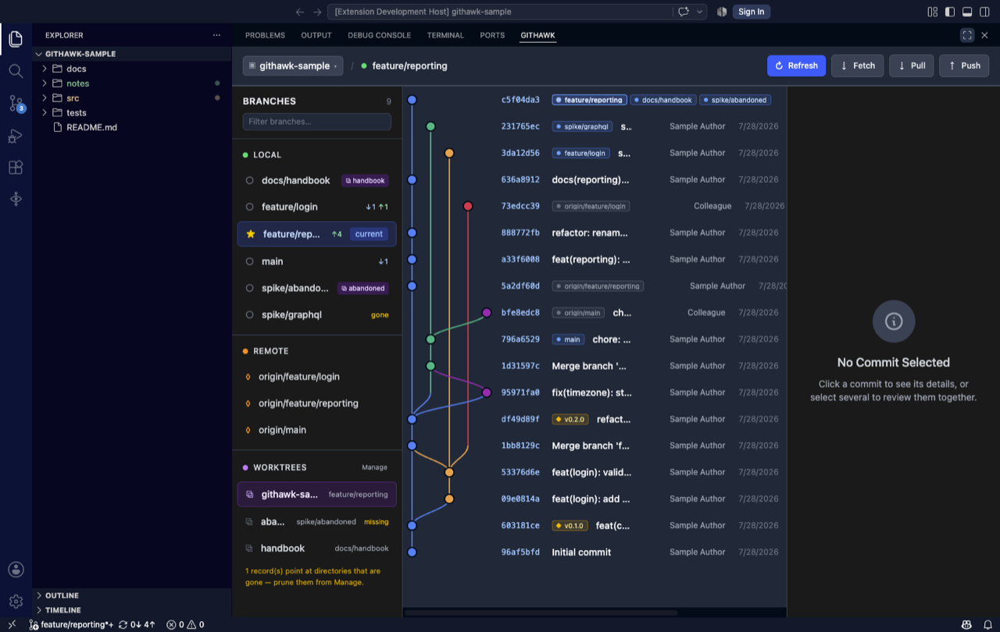
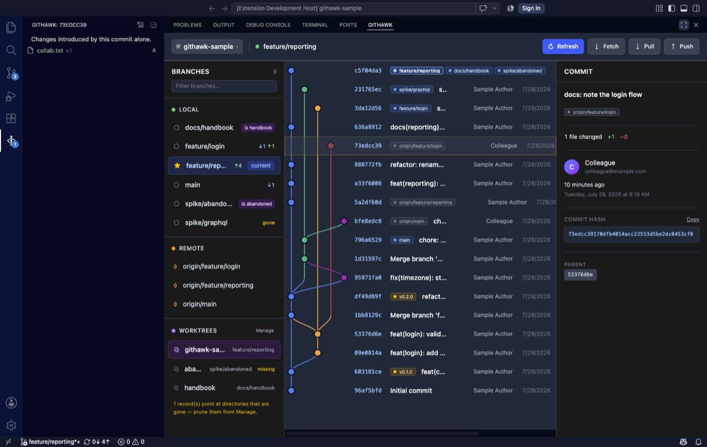
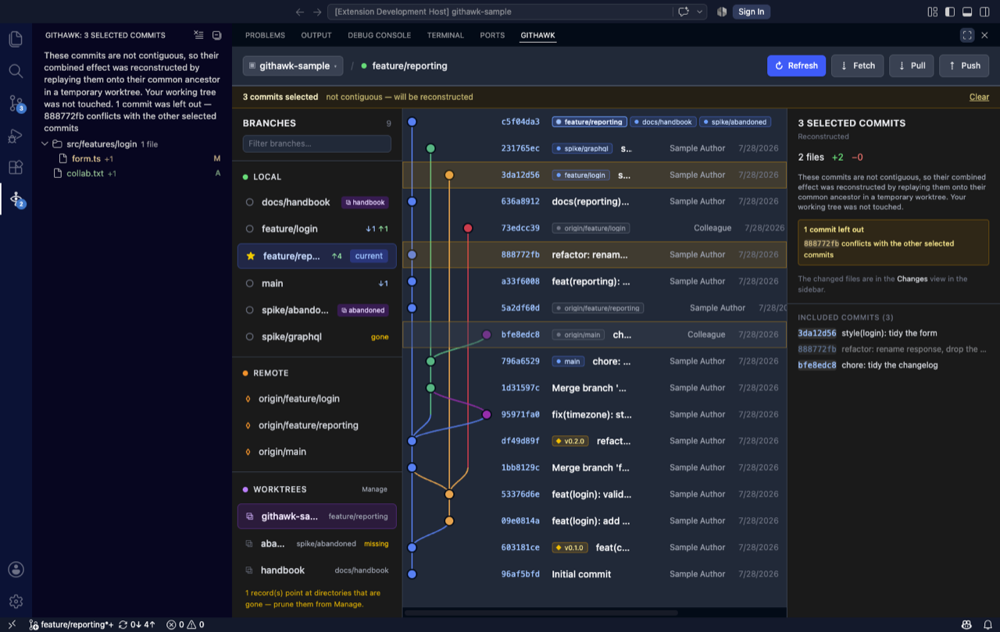
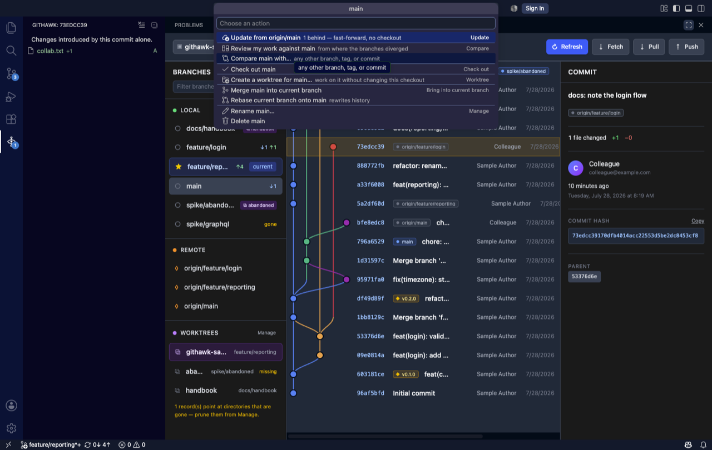
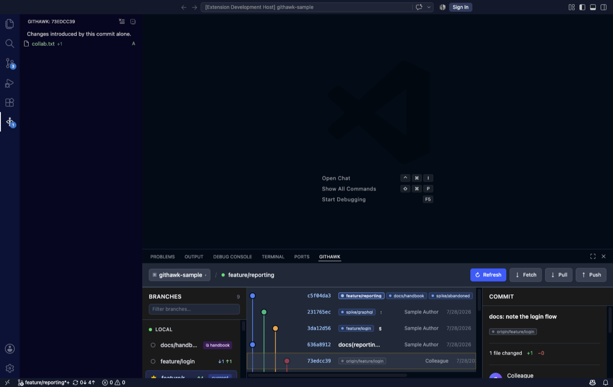
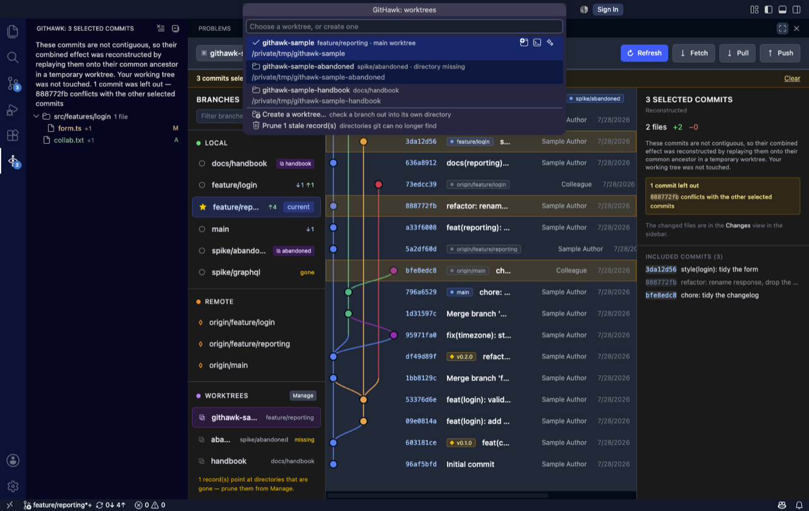

# GitHawk

**A git graph for VS Code that is just a git graph.** No AI, no telemetry, no
account, no cloud. MIT licensed.



> **Preview.** Everything documented here works and is covered by tests. What it
> does not do yet: follow your colour theme (the panel is dark whatever your
> theme), stay fast on very long histories, or help you out of a conflicted merge.

## Install

Search **GitHawk** in the Extensions view, or:

```
code --install-extension kfirzvi-com.githawk
```

Then press **`Cmd+9`** (**`Ctrl+9`** on Windows and Linux) — or run
**`GitHawk: Open Git Graph`**. The graph opens in the panel at the bottom; changed
files appear in a tree in the sidebar under the GitHawk icon.

Nothing to configure to get started.

## Why another one

[Git Graph](https://github.com/mhutchie/vscode-git-graph) is what most people used,
and it has been abandoned
([#913](https://github.com/mhutchie/vscode-git-graph/issues/913),
[#838](https://github.com/mhutchie/vscode-git-graph/issues/838)) with millions of
installs still depending on it. Its licence looks like MIT but removes the right to
`publish, distribute, sublicense, and/or sell derivative works` — so it is not open
source, and nobody can legally ship a maintained fork.

GitHawk is a clean-room replacement under a real MIT licence. Meanwhile the
maintained alternatives keep adding AI to a tool whose entire job is drawing lines
between commits.

## What it does

### Read the graph

Commits in correct topological order — a parent is never drawn above its child,
even after a rebase or a cherry-pick. Lanes are reused as soon as a branch ends, so
the gutter stays narrow on repositories with dozens of branches. Branches, remote
branches, tags, and a detached HEAD are each labelled distinctly.

### See what a commit changed



Click a commit: its full message, author, date, and hash appear on the right, and
its files fill the **Changes** tree in the sidebar. Click a file to open it in
VS Code's own diff editor.

The sidebar is surfaced the first time and then left alone — pulling focus on
every click would make the graph unbrowsable. To ask for it deliberately, once it
has been closed or covered, right-click a commit and choose **"Show changes in
the sidebar"**.

### Review a whole branch, or any set of commits



- **Click a branch → "Review my work against …"** — everything your branch adds
  relative to that one, measured from the merge base, including work you have not
  committed yet.
- **Cmd/Ctrl-click** several commits, or **Shift-click** for a run. Their combined
  changeset appears automatically — selecting *is* the request, there is no button.
  They do not have to be next to each other.
- **"Compare … with …"** — any two branches, tags, or commits, directly. Neither
  side has to involve where you currently are, so you can sit on `main` and compare
  two other branches.

The tree always states how the comparison was made, because a merge-base diff, a
direct diff, and a reconstruction answer different questions.

### Act on branches and commits



Click a branch, or right-click a commit, and you get a native VS Code menu —
grouped by topic, with your keyboard shortcuts and theme, not a menu drawn inside a
webview.

On a commit: create a branch or tag here, check it out, cherry-pick, revert, reset,
copy the hash. On a branch: push, pull, check out, merge, rebase, rename, delete, or
delete it on the remote.

**Push and pull are per branch, and always there.** The **Sync** group at the top
of a branch's menu offers both every time, with the state in the description —
`3 behind`, `nothing to push`, `already up to date` — rather than appearing only
when there is something to do. A branch that has never been pushed offers
**"Publish"** instead, which sets its upstream so the next push needs no arguments.
There is no `--force` anywhere, so git refusing a non-fast-forward is left to
refuse.

**`main` is behind while you are on a feature branch?** That does not need a
checkout. Pulling a branch you are *not* standing on writes the ref directly — your
working tree, index, and HEAD are untouched — and the menu says so. The branch list
shows ↓ behind, ↑ ahead, or `gone` at a glance, and
**`GitHawk: Update All Branches From Upstream`** does every eligible one at once.

Anything destructive asks first, and says what will be lost.

### Manage remotes

**`GitHawk: Manage Remotes`** lists every remote with its URL, and a remote with a
separate push URL — the fork workflow, reading from upstream and writing to your own
copy — shows both, because being shown one of two is how you push somewhere you did
not mean to.

Add, rename, re-point, or remove one; fetch a single remote with pruning from the
list without opening anything; or prune deleted branches without fetching. Removing
a remote and pruning both ask first: they delete tracking refs, and nothing in the
reflog brings those back.

### Work across several repositories



Open a folder of projects and GitHawk finds the repositories inside it. The name at
the left of the toolbar switches between them; so does
**`GitHawk: Switch Repository`**. Switching moves everything with it — graph,
menus, comparisons, and the Changes tree.

Submodules, linked worktrees, and repositories nested inside a monorepo are all
found. How deep it looks is [`gitHawk.repositoryScanDepth`](#settings).

### Keep up with the repository

Commit in a terminal, check out from the Source Control view, let an agent rebase
in a worktree — the graph reloads on its own. GitHawk watches git's metadata, not
your working tree, and waits for an operation to finish rather than redrawing on
every step of a rebase. Your place in the history is kept: the row you are
looking at stays where it is instead of sliding down as commits arrive above it.

### Manage worktrees



A worktree is a second directory with a different branch checked out, sharing one
repository. They stay niche because git's errors are opaque — it refuses a checkout
because of a directory you deleted last month, and tells you only that the branch
"is already used by worktree at …".

GitHawk names the rule instead:

- A branch checked out in another worktree is **badged in the branch list**, so you
  can see before clicking that a checkout would be refused. Its menu offers to
  **open that worktree** instead.
- A **Worktrees** section appears in the sidebar once you have more than one,
  flagging `locked` and `missing`.
- Any free branch offers **Create a worktree for …**, suggesting a sibling of the
  repository named after the branch.
- A worktree whose directory is gone is reported as `missing` with a **Prune**
  entry — until that record is cleared, git keeps refusing its branch everywhere.

Each row has buttons to **open a new VS Code window**, **open a terminal**, or
**start an AI CLI** there — Claude Code, Codex, Gemini CLI, and opencode by
default, configurable. That is the one place AI appears in GitHawk: launching your
tool in the right directory. It reads nothing and sends nothing.

## Settings

| Setting | Default | What it does |
| --- | --- | --- |
| `gitHawk.commitLimit` | `500` | How many commits to read. Higher shows more and loads slower. |
| `gitHawk.autoRefresh` | `true` | Reload the graph when the repository changes outside GitHawk. Watches git's metadata, never your working tree. |
| `gitHawk.repositoryScanDepth` | `2` | Directory levels below each opened folder to search for repositories. `0` searches the folders only; `2` covers a folder of projects, or a folder of buckets each holding projects. |
| `gitHawk.aiTools` | Claude Code, Codex, Gemini CLI, opencode | Commands offered by "Start an AI CLI here". |

## Commands

| Command | |
| --- | --- |
| `GitHawk: Open Git Graph` | `Cmd+9` / `Ctrl+9` |
| `GitHawk: Refresh Git Graph` | Also rescans for new repositories |
| `GitHawk: Switch Repository` | |
| `GitHawk: Manage Worktrees` | |
| `GitHawk: Manage Remotes` | Add, rename, re-point, remove, fetch, prune |
| `GitHawk: Start An AI CLI Here` | |
| `GitHawk: Update All Branches From Upstream` | Fast-forwards every branch that can be |
| `GitHawk: Show Log` | GitHawk's own output, when something goes wrong |

## Known limitations

Honest list, in the order they are likely to annoy you:

- **The panel is dark regardless of your theme.** On a light theme it looks wrong.
- **No row virtualisation.** A large `commitLimit` renders every row; 500 is fine,
  5000 is not.
- **A conflicting merge or rebase leaves you mid-operation.** GitHawk reports git's
  message but offers no abort or resolution.
- **One repository at a time** — there is no combined view across several.
- **Repositories are found by scanning on load, not watched.** One cloned while the
  window is open needs a refresh.

## Contributing

Bug reports and pull requests are welcome —
[issues](https://github.com/kfirzvi-com/githawk/issues).
See [CONTRIBUTING.md](CONTRIBUTING.md) for the architecture, how to run it locally,
and how the three tiers of tests work.

## Licence

MIT — see [LICENSE](LICENSE). Actually MIT, in the sense that you may fork it,
ship it, and sell it.
