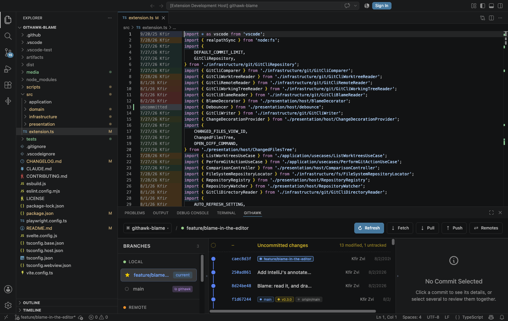

<h1></h1>

**A git graph for VS Code that is just a git graph.** No AI, no telemetry, no
account, no cloud. MIT licensed.


> **Preview.** Everything documented here works and is covered by tests. What it
> does not do yet: stay fast on very long histories, or help you out of a
> conflicted merge.

## Install

Search **GitHawk** in the Extensions view, or:

```
code --install-extension kfirzvi-com.githawk
```

Then press **`Cmd+9`** (**`Ctrl+9`** on Windows and Linux) — or run
**`GitHawk: Open Git Graph`**. The graph opens in the panel at the bottom; changed
files appear in a tree in the sidebar under the GitHawk icon.

Nothing to configure to get started.

## Why another one

[Git Graph](https://github.com/mhutchie/vscode-git-graph) is what most people used,
and it has been abandoned
([#913](https://github.com/mhutchie/vscode-git-graph/issues/913),
[#838](https://github.com/mhutchie/vscode-git-graph/issues/838)) with millions of
installs still depending on it. Its licence looks like MIT but removes the right to
`publish, distribute, sublicense, and/or sell derivative works` — so it is not open
source, and nobody can legally ship a maintained fork.

GitHawk is a clean-room replacement under a real MIT licence. Meanwhile the
maintained alternatives keep adding AI to a tool whose entire job is drawing lines
between commits.

## What it does

### Look like the rest of your editor

Every colour comes from VS Code's own theme tokens, so the panel is light on a
light theme and high-contrast on a high-contrast one. Only the lane colours are
fixed: a lane has to keep its colour as your eye follows it down the graph, and
stay distinct from the seven beside it, so they are eight hues chosen to hold
their contrast against white and near-black alike.

### Read the graph

Commits in correct topological order — a parent is never drawn above its child,
even after a rebase or a cherry-pick. Lanes are reused as soon as a branch ends, so
the gutter stays narrow on repositories with dozens of branches. Branches, remote
branches, tags, and a detached HEAD are each labelled distinctly.

### See what a commit changed


Click a commit: its full message, author, date, and hash appear on the right, and
its files fill the **Changes** tree in the sidebar. Click a file to open it in
VS Code's own diff editor.

The sidebar is surfaced the first time and then left alone — pulling focus on
every click would make the graph unbrowsable. To ask for it deliberately, once it
has been closed or covered, right-click a commit and choose **"Show changes in
the sidebar"**.
### See what you have not committed — and commit it


A row above the newest commit, whenever there is anything uncommitted, saying
what kind — `2 staged, 1 modified, 3 untracked`. Click it, or arrow up onto it
and press Enter, and the sidebar becomes the place a commit is made:

- The **Changes** tree fills with everything uncommitted, in the sections git
  itself keeps — **Staged Changes**, **Changes**, **Untracked Files**, and
  **Merge Conflicts** when there are any. Each file opens the diff its section
  means: a staged file is `HEAD` against the index, an unstaged one the index
  against the disk, an untracked one against nothing. Hover a row for **+** to
  stage it or **−** to unstage it; the same buttons on a section or a folder
  take everything beneath.
- A **Commit** box appears above the tree: a message, a button that says what it
  will do — `Commit 2 staged files`, or `Commit all changes` when nothing is
  staged, which asks before staging everything — and <kbd>⌘</kbd>/<kbd>Ctrl</kbd>
  <kbd>Enter</kbd> to press it. A first line over 72 characters is pointed out.
  The draft survives clicking around the graph; the box leaves with the last
  uncommitted file.
- **Generate** asks an AI CLI to write the message. Pick the tool in the select
  beside it — Claude Code, Codex, Gemini CLI and opencode are configured out of
  the box, in `gitHawk.aiTools` — and the diff of what would be committed is
  piped to it, once, non-interactively, through your shell; what it prints lands
  in the box for you to edit. Nothing is committed on the strength of it. No
  model runs inside GitHawk and nothing leaves your machine except through the
  tool you chose, exactly as if you had run it in a terminal.

The row disappears when the tree is clean, so its presence is the answer to "is
there anything here?". Unlike a commit, clicking it surfaces the sidebar every
time: browsing the graph is many clicks across many commits and the sidebar
should not chase each one; there is only ever one of these rows, so clicking it
is only ever a request to see the files.

Its marker is hollow and dashed rather than a commit dot, because it is not a
commit: nothing points at it, it has no hash, and it looks different the moment
you save a file. Nothing draws a line from it to `HEAD` either — the graph reads
every ref, so the topmost row is often not the commit your changes sit on, and a
line saying otherwise would be wrong more often than right.

Every diff GitHawk opens — from a commit or from the working tree — has a
**Reveal in Explorer View** button in its title bar and its tab's right-click
menu, so the file you are reading a change to is one click from where it lives.
The Changes tree's rows offer the same on right-click.

The tree keeps up by itself: saving a file, or creating or deleting one through
the explorer, moves it to the section it now belongs in. `GitHawk: Show
Uncommitted Changes` opens the same view without the panel; `GitHawk: Commit`
opens it and puts the caret in the message.

### See who wrote a line, and jump to why



Set [`gitHawk.blame.style`](#settings) to `column` and every line carries the
date and author of the commit it came from, in a fixed-width column between the
line numbers and the code — IntelliJ's annotate, in VS Code.

Each commit gets its own colour, and the colours run in order: cool for the
oldest lines in the file, warm for the newest. So a run of lines from one commit
reads as a block without needing a separator, and scrolling shows the order the
file was built in rather than just that several people built it.

Hover any line for the full message, the author, the date, how many lines that
commit owns here — and **"show in the graph"**, which opens the panel, selects
the commit, and fills the Changes tree. That is the part no standalone blame
extension can do: the graph is already here.

`endOfLine` is the quieter option — one label per block, at the end of its first
line, leaving your code where it is. Both blame the editor's buffer rather than
the file on disk, so annotations stay honest while you are part-way through an
edit.

Turn it on with **`GitHawk: Toggle Blame Annotations`**, the person icon in the
editor's title bar, or right-click in the editor. Off is the default, and the
toggle switches between off and the column — set `gitHawk.blame.style` directly
for `endOfLine`. Annotations appear in the diff editor
too — both sides, each blamed as of its own revision, which is the question a
diff raises.

### Hold Shift to see the keyboard

Hold <kbd>Shift</kbd> and every control that has a shortcut shows its key, right
on the control. Keep holding, press the key, and it runs.

Nothing to memorise and nothing to look up: the list of shortcuts *is* the
screen, so it is always accurate and always beside the thing it acts on. A badge
only appears where the key does something — fold the branch list away and its
four keys go with it.

| | |
| --- | --- |
| <kbd>⇧R</kbd> <kbd>⇧F</kbd> <kbd>⇧U</kbd> <kbd>⇧P</kbd> | Refresh, Fetch, Pull (update), Push |
| <kbd>⇧O</kbd> | Switch repository |
| <kbd>⇧B</kbd> <kbd>⇧D</kbd> | Fold the branch list, or commit details, away |
| <kbd>⇧E</kbd> | Expand the panel to the window, or put it back |
| <kbd>⇧K</kbd> | Filter branches |
| <kbd>⇧M</kbd> <kbd>⇧W</kbd> <kbd>⇧S</kbd> | Manage remotes, worktrees, stashes |
| <kbd>⇧C</kbd> <kbd>⇧X</kbd> | Clear a multi-commit selection; diff the two selected |
| <kbd>⇧G</kbd> <kbd>⇧V</kbd> <kbd>⇧A</kbd> | Put the cursor in the graph; pick commits; show what the selection changed |
| <kbd>⇧T</kbd> | Check out a branch |

Shift alone is only a modifier, so <kbd>Shift</kbd>-click still extends a
selection in the graph, and a capital letter typed in the branch filter is still
a capital letter. Nothing here shadows one of your VS Code bindings: Ctrl, Cmd
and Alt combinations are left alone.

### Drive the graph without the mouse

<kbd>⇧G</kbd> puts a cursor on a commit — the one you already had selected, or
the newest — and from there the graph behaves like any other list.

| | |
| --- | --- |
| <kbd>↑</kbd> <kbd>↓</kbd> | Move the cursor. It selects nothing, so you can read your way down a branch without the panel doing any work |
| <kbd>Home</kbd> <kbd>End</kbd> | Newest commit, oldest commit |
| <kbd>PgUp</kbd> <kbd>PgDn</kbd> | A screenful at a time |
| <kbd>Enter</kbd> | The left click: select this commit and show what it changed |
| <kbd>⇧Enter</kbd> | The right click: this commit's menu. <kbd>Menu</kbd> and <kbd>⇧F10</kbd> do it too |

**Picking several.** <kbd>⇧V</kbd> turns <kbd>Space</kbd> into a picker and says
so in a banner. Move with the arrows, <kbd>Space</kbd> to tick a commit in or
out, and nothing is sent anywhere while you choose — that is the point of the
mode. <kbd>Enter</kbd> then shows the combined changes and leaves;
<kbd>Esc</kbd> leaves and keeps your picks without asking for anything.

<kbd>⇧A</kbd> asks for the selection's changes at any time, however the
selection was made — the way back to the Changes view once you have scrolled off
it.

The cursor is deliberately not the selection. A cursor that selected as it moved
would spawn a worktree per keystroke; this one costs nothing until you press
something.

### Give the graph the room

The panel is short and splits its width three ways. Either side pane folds away
with the thin handle beside it — the handle stays where it is when the pane is
gone, so the way back is where the way out was — and the graph takes the space.
GitHawk remembers which panes you had.

Height is the other half of the problem, and it belongs to the workbench rather
than to us: the <kbd>⇕</kbd> button in the toolbar — or <kbd>⇧E</kbd> — grows the
panel to the window and puts it back. VS Code has its own chevron for this in the
panel's title bar; a graph is the one thing in there that always wants the height,
so it gets a control where you are already looking.

### Review a whole branch, or any set of commits


- **Click a branch → "Review my work against …"** — everything your branch adds
  relative to that one, measured from the merge base, including work you have not
  committed yet.
- **Cmd/Ctrl-click** several commits, or **Shift-click** for a run. Their combined
  changeset appears automatically — selecting *is* the request, there is no button.
  They do not have to be next to each other.
- **"Compare … with …"** — any two branches, tags, or commits, directly. Neither
  side has to involve where you currently are, so you can sit on `main` and compare
  two other branches.

The tree always states how the comparison was made, because a merge-base diff, a
direct diff, and a reconstruction answer different questions.

### Act on branches and commits


Click a branch, or right-click a commit, and you get a native VS Code menu —
grouped by topic, with your keyboard shortcuts and theme, not a menu drawn inside a
webview.

The branch labels drawn on the graph are the same click target as the branch list,
so a branch is actionable wherever you happen to be looking at it. Both offer
**"Copy branch name"** — a webview cannot be text-selected, and a branch name is
what gets retyped into a checkout, a PR description, or a CI filter.

On a commit: create a branch or tag here, check it out, cherry-pick, revert, reset,
copy the hash. On a branch: push, pull, check out, merge, rebase, rename, delete, or
delete it on the remote.

**Push and pull are per branch, and always there.** The **Sync** group at the top
of a branch's menu offers both every time, with the state in the description —
`3 behind`, `nothing to push`, `already up to date` — rather than appearing only
when there is something to do. A branch that has never been pushed offers
**"Publish"** instead, which sets its upstream so the next push needs no arguments.
There is no `--force` anywhere, so git refusing a non-fast-forward is left to
refuse.

**`main` is behind while you are on a feature branch?** That does not need a
checkout. Pulling a branch you are *not* standing on writes the ref directly — your
working tree, index, and HEAD are untouched — and the menu says so. The branch list
shows ↓ behind, ↑ ahead, or `gone` at a glance, and
**`GitHawk: Update All Branches From Upstream`** does every eligible one at once.

Anything destructive asks first, and says what will be lost.

### Put work aside

Stash entries appear in the graph as rows of their own, hanging off the commit
the work was left on, and in the sidebar beside the branches and worktrees. All
four sidebar sections — local, remote, worktrees, stashes — are always there,
each folding away and remembering it, and each saying what it is for when there
is nothing in it. Remote, Worktrees and Stashes carry a **Manage** button.

**`GitHawk: Manage Stashes`** lists the stash with what each entry says it is,
the branch it was made on, and when. An entry git named itself — `WIP on main:
1234abc …` — is marked `(unnamed)`, because that wording describes the commit
the work was sitting on rather than the work.

Apply an entry from the list in one click, or open it for the rest: **show what
is in it** in the Changes tree, apply, pop, or drop. Stashing asks for a message
and whether to include untracked files, which is never the default — it is the
one variant that sweeps up a scratch file you had not thought about.

Popping and dropping ask first. Both remove the entry, and a dropped entry
survives only as a dangling commit.

A stash entry is a commit, so showing what is in it is the same comparison
machinery as everything else — it lands in the Changes tree and opens in the
diff editor.

### Manage remotes

**Manage** on the sidebar's Remote section, or **`GitHawk: Manage Remotes`**.
Either lists every remote with its URL, and a remote with a
separate push URL — the fork workflow, reading from upstream and writing to your own
copy — shows both, because being shown one of two is how you push somewhere you did
not mean to.

Add, rename, re-point, or remove one; fetch a single remote with pruning from the
list without opening anything; or prune deleted branches without fetching. Removing
a remote and pruning both ask first: they delete tracking refs, and nothing in the
reflog brings those back.

### Work across several repositories


Open a folder of projects and GitHawk finds the repositories inside it. The name at
the left of the toolbar switches between them; so does
**`GitHawk: Switch Repository`**. Switching moves everything with it — graph,
menus, comparisons, and the Changes tree.

Submodules, linked worktrees, and repositories nested inside a monorepo are all
found. How deep it looks is [`gitHawk.repositoryScanDepth`](#settings).

### Keep up with the repository

Commit in a terminal, check out from the Source Control view, let an agent rebase
in a worktree — the graph reloads on its own. GitHawk watches git's metadata, not
your working tree, and waits for an operation to finish rather than redrawing on
every step of a rebase. Your place in the history is kept: the row you are
looking at stays where it is instead of sliding down as commits arrive above it.

### Manage worktrees


A worktree is a second directory with a different branch checked out, sharing one
repository. They stay niche because git's errors are opaque — it refuses a checkout
because of a directory you deleted last month, and tells you only that the branch
"is already used by worktree at …".

GitHawk names the rule instead:

- A branch checked out in another worktree is **badged in the branch list**, so you
  can see before clicking that a checkout would be refused. Its menu offers to
  **open that worktree** instead.
- A **Worktrees** section appears in the sidebar once you have more than one,
  flagging `locked` and `missing`.
- Any free branch offers **Create a worktree for …**, suggesting a sibling of the
  repository named after the branch.
- A worktree whose directory is gone is reported as `missing` with a **Prune**
  entry — until that record is cleared, git keeps refusing its branch everywhere.

Each row has buttons to **open a new VS Code window**, **open a terminal**, or
**start an AI CLI** there — Claude Code, Codex, Gemini CLI, and opencode by
default, configurable. That is the one place AI appears in GitHawk: launching your
tool in the right directory. It reads nothing and sends nothing.

### In the editor

Three keys that work where the code is, rather than in the panel. All three are
chords under <kbd>⌘K</kbd> (<kbd>Ctrl+K</kbd> on Windows and Linux), and none of
them was already bound by VS Code.

| | |
| --- | --- |
| <kbd>⌘K</kbd> <kbd>B</kbd> | Blame on, and off again |
| <kbd>⌘K</kbd> <kbd>H</kbd> | Who wrote this line — the same card the mouse gets, at the caret. Works whether or not the annotations are on |
| <kbd>⌘K</kbd> <kbd>G</kbd> | Show this line's commit in the graph |

They are also in the editor's right-click menu, under **GitHawk**, which is
where the keys announce themselves — a shortcut nobody can find is a shortcut
nobody has. The hover card names <kbd>⌘K</kbd> <kbd>G</kbd> beside its "show in
the graph" link for the same reason.

<kbd>⌘K</kbd> <kbd>G</kbd> follows the file rather than the panel: a workspace
usually holds more than one repository, and if the file you are reading is in a
different one, GitHawk switches to it and then shows the commit.

## Settings

| Setting | Default | What it does |
| --- | --- | --- |
| `gitHawk.commitLimit` | `500` | How many commits to read. Higher shows more and loads slower. |
| `gitHawk.blame.style` | `off` | Blame in the editor: `column` for IntelliJ's annotate, `endOfLine` for one label per block. |
| `gitHawk.autoRefresh` | `true` | Reload the graph when the repository changes outside GitHawk. Watches git's metadata, never your working tree. |
| `gitHawk.repositoryScanDepth` | `2` | Directory levels below each opened folder to search for repositories. `0` searches the folders only; `2` covers a folder of projects, or a folder of buckets each holding projects. |
| `gitHawk.aiTools` | Claude Code, Codex, Gemini CLI, opencode | The AI CLIs GitHawk knows: `command` for "Start an AI CLI here", and `commitMessageCommand` — the same tool run once, non-interactively, prompt on stdin — for **Generate** in the commit box. Leave the latter out to keep a tool out of the picker. |

## Commands

| Command | |
| --- | --- |
| `GitHawk: Open Git Graph` | `Cmd+9` / `Ctrl+9` |
| `GitHawk: Toggle Blame Annotations` | `Cmd+K B` / `Ctrl+K B` |
| `GitHawk: Refresh Git Graph` | Also rescans for new repositories |
| `GitHawk: Switch Repository` | |
| `GitHawk: Check Out A Branch` | The branch list as a picker |
| `GitHawk: Who Wrote This Line` | `Cmd+K H` / `Ctrl+K H` |
| `GitHawk: Show This Line's Commit In The Graph` | `Cmd+K G` / `Ctrl+K G` |
| `GitHawk: Manage Worktrees` | |
| `GitHawk: Manage Remotes` | Add, rename, re-point, remove, fetch, prune |
| `GitHawk: Manage Stashes` | List, show, apply, pop, drop; stash the working tree |
| `GitHawk: Show Uncommitted Changes` | Staged, changed and untracked files, with the commit box |
| `GitHawk: Commit` | The same, with the caret in the message |
| `GitHawk: Write The Commit Message With An AI CLI` | Generate, from the palette |
| `GitHawk: Stage All Changes` | |
| `GitHawk: Reveal In Explorer View` | The file behind the diff you are reading |
| `GitHawk: Start An AI CLI Here` | |
| `GitHawk: Update All Branches From Upstream` | Fast-forwards every branch that can be |
| `GitHawk: Show Log` | GitHawk's own output, when something goes wrong |

## Known limitations

Honest list, in the order they are likely to annoy you:

- **No row virtualisation.** A large `commitLimit` renders every row; 500 is fine,
  5000 is not.
- **A conflicting merge or rebase leaves you mid-operation.** GitHawk reports git's
  message but offers no abort or resolution.
- **One repository at a time** — there is no combined view across several.
- **Repositories are found by scanning on load, not watched.** One cloned while the
  window is open needs a refresh.

## Contributing

Bug reports and pull requests are welcome —
[issues](https://github.com/kfirzvi-com/githawk/issues).
See [CONTRIBUTING.md](CONTRIBUTING.md) for the architecture, how to run it locally,
and how the three tiers of tests work.

## Licence

MIT — see [LICENSE](LICENSE). Actually MIT, in the sense that you may fork it,
ship it, and sell it.
